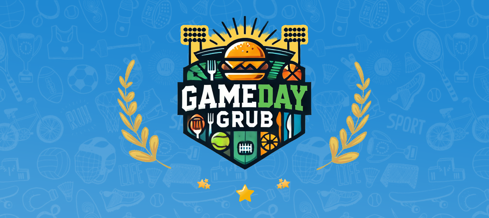
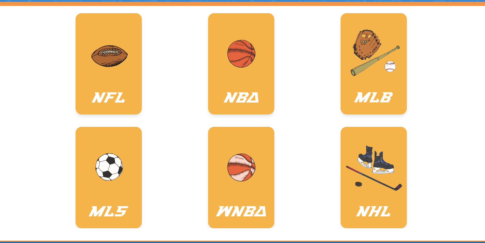
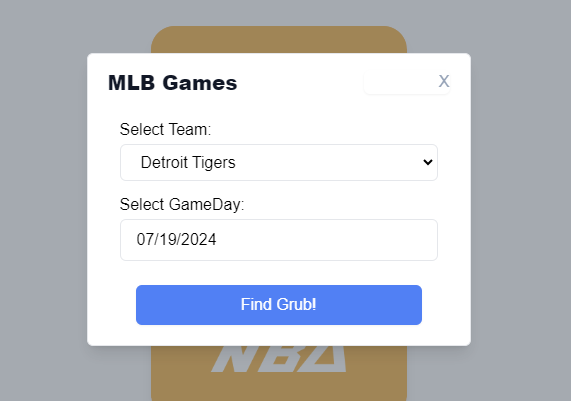
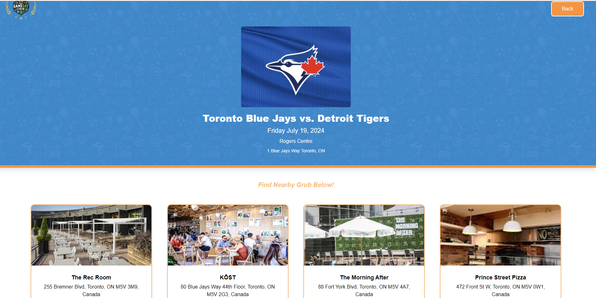
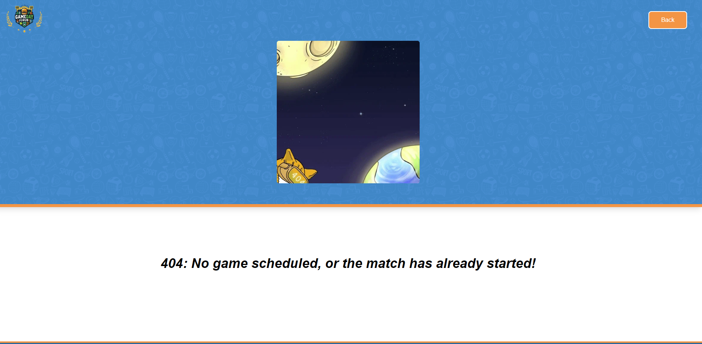

# Gameday Grub

## Description

**GameDay Grub** is your ultimate companion for finding the perfect place to eat while traveling to cheer on your favorite team. This app seamlessly integrates real-time sports schedules with a curated list of restaurants, sports bars, and eateries. Simply select your favorite team and their game date, and GameDay Grub will show you the best nearby venues where you can enjoy delicious food and drinks, along with the game day atmosphere. Whether you’re looking for a lively sports bar or a cozy restaurant with big screens, GameDay Grub has you covered!

## Screenshots

The following screenshots shows the blog's appearance

## Codebase

You can find the project repository [here](https://github.com/shreyareddy6/gameday-grub.git)

You can find the deployed page [here](https://shreyareddy6.github.io/gameday-grub/)

## Contributors

Melvin Urias
Justin McLaughlin
Brian Zhen
Shreya Yerragudi

## License

Please refer to the LICENSE in the repo.
